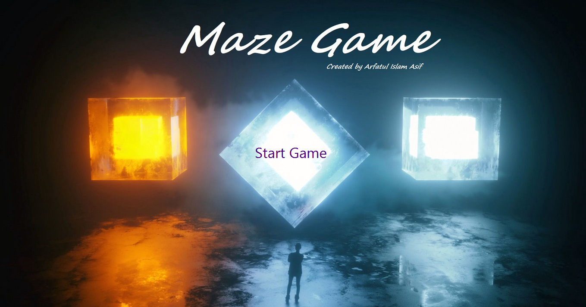
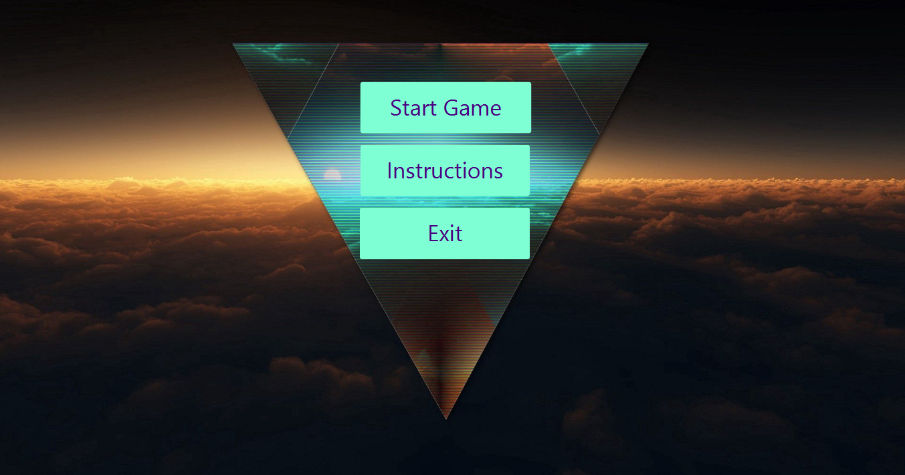
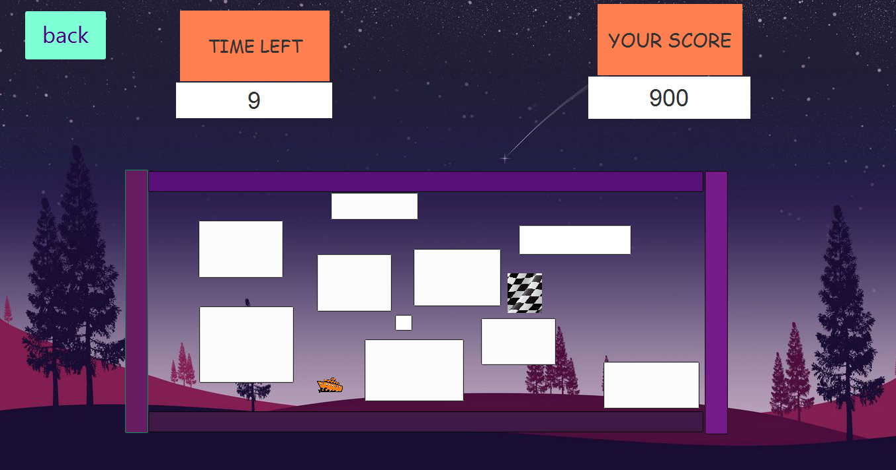
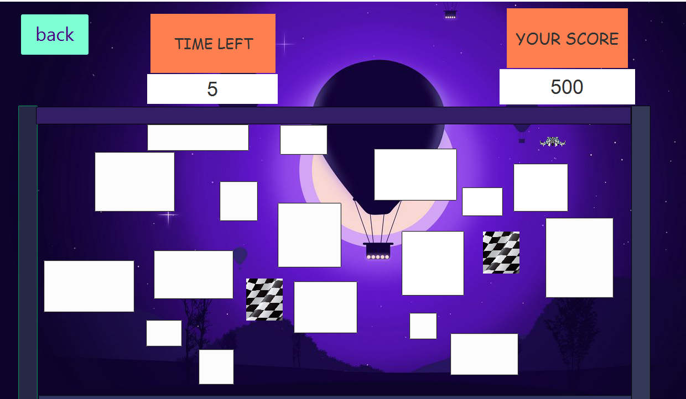
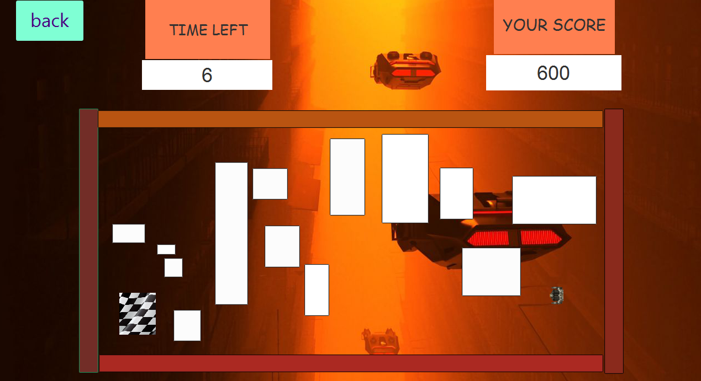

# MazeGame-javafx-Project

```
This is a game about:
Man vs Time
Vehicle vs Maze
Keyboard vs Pixels
```






<h2>To run the Game , download the MazeGame.jar file and follow the steps. </h2>


<h1>Step : 1</h1>
Download javafx-sdk-version 20 or higher
<h1> Step : 2</h1>
Go to cmd and 

```
cd "path where your store MazeGame.jar"
```

<h1>Step : 3</h1>

[Hints: Provide proper module path . You will find module path from where you have downloaded and extracted the javafx-sdk-20 . Go to the lib folder and copy the address and paste here in the " double quotation " .]

```
java --module-path "javafx-sdk-version-20 or higher/lib" --add-modules javafx.controls,javafx.fxml,javafx.graphics,javafx.media -jar MazeGame.jar
```

